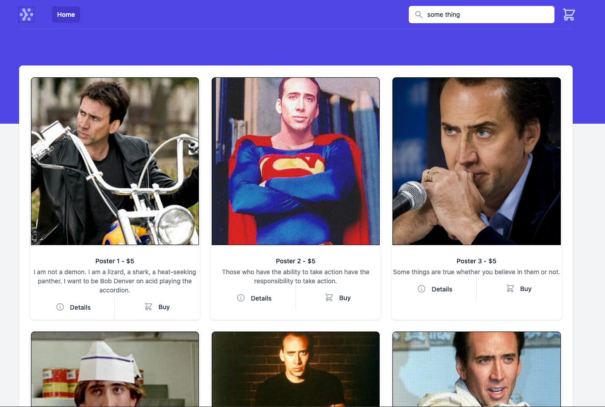
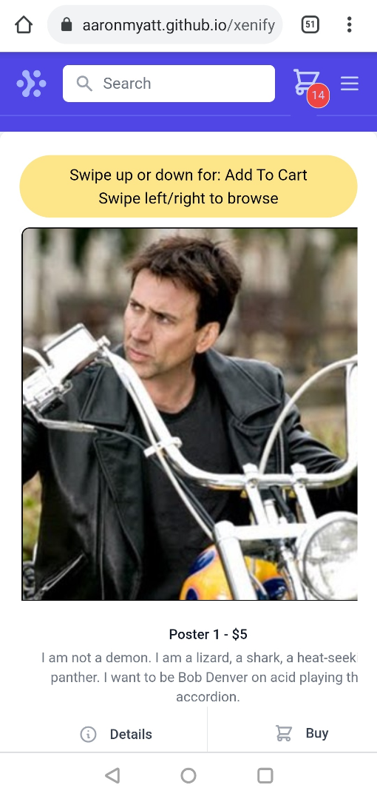

# Xenify

## The Nicholas Cage memorabilia store you never knew you needed.

*It's Alive!*

    Visit: https://aaronmyatt.github.io/xenify/

## Built With
-  [Vite](https://vitejs.dev/)
-  Vue3
-  Typescript
-  JSX
-  Tailwind
   -  With templates pulled from Tailwindui

## Setup
1) Setup Bleeding Edge Vite: https://vitejs.dev/guide/#using-unreleased-commits
2) Clone this repo
3) Run `yarn` to install dependencies
4) Run `yarn dev` to start dev server
5) $Profit$

## Blurb
Whenever I get an opportunity to bootstrap a "Breakable Toy" project, I can't help but use it as an opportunity to learn a few tools I've had my eye on (e.g. Vite, Vue3, Typescript), how else to make it extra fun (and stressful!).

I've put a fair amount of effort in to ensure I've met the minimum requirements, and as much polish as I could sneak in within the limited time I could spare for this, including functional cart, basic search, persistent state (Local Storage), and also some fun with gestures and animations on the mobile version, check it out:

All in all, I had fun building and learning my way through this.

Don't forgot to give thanks to our Lord and Saviour, Nicholas :troll:

